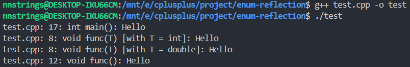
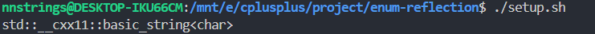
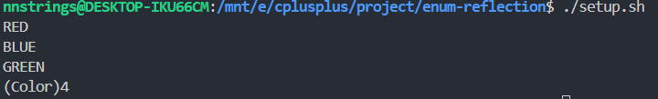

# 枚举类型编译期反射

首先介绍一些 C++ 的一些宏定义：

- \_\_FILE\_\_: 可以打印出文件的绝对路径和相对路径（如果编译时使用绝对路径，则打印绝对路径，如果编译时使用相对路径，则打印相对路径）
- \_\_LINE\_\_: 可以打印出使用该宏的行号
- \_\_func\_\_: 可以打印出使用该宏的函数（但是不能区分重载和模板函数）
- \_\_PRETTY_FUNCTION\_\_: 可以打印出使用该宏的函数（可以区分重载和模板函数）

这里举一个简单的例子：

```cpp
#define LOG(x) (std::cout << __FILE__ << ": " << __LINE__ << ": " \
                          << __PRETTY_FUNCTION__ << ": " << (x) << std::endl)

template<typename T>
void func(T x) {
    LOG("Hello");
}

void func() {
    LOG("Hello");
}

int main()
{
    LOG("Hello");
    func(1);
    func(1.3);
    func();
    return 0;
}
```

打印结果：



接着，我们使用 `__PRETTY_FUNCTION__` 来获取一个类型的实际类型（类似于萃取的功能）

```cpp
template<typename T>
std::string get_type_name() {
    std::string s =  __PRETTY_FUNCTION__;
    auto pos1 = s.find("T = ");
    pos1 += 4;
    auto pos2 = s.find_first_of(";]", pos1);
    return s.substr(pos1, pos2 - pos1);
}

int main()
{
    std::cout << get_type_name<std::string>() << std::endl;
    return 0;
}
```

通过上述代码，我们可以查看 `std::string` 的类型是什么



然后，我们我们编写一个反射枚举类型的实例：

```cpp
template<typename T, T N>
std::string get_int_name() {
    std::string s =  __PRETTY_FUNCTION__;
    auto pos1 = s.find("N = ");
    pos1 += 4;
    auto pos2 = s.find_first_of(";]", pos1);
    return s.substr(pos1, pos2 - pos1);
}

enum Color {
    RED = 1, BLUE, GREEN
};

int main()
{
    std::cout << get_int_name<Color, static_cast<Color>(1)>() << std::endl;
    std::cout << get_int_name<Color, static_cast<Color>(2)>() << std::endl;
    std::cout << get_int_name<Color, static_cast<Color>(3)>() << std::endl;
    std::cout << get_int_name<Color, static_cast<Color>(4)>() << std::endl;
    return 0;
}
```

运行结果：



